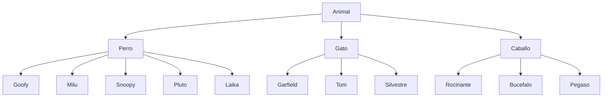
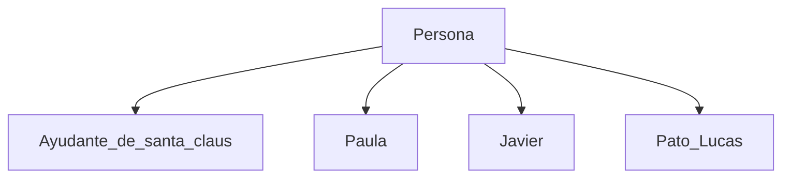
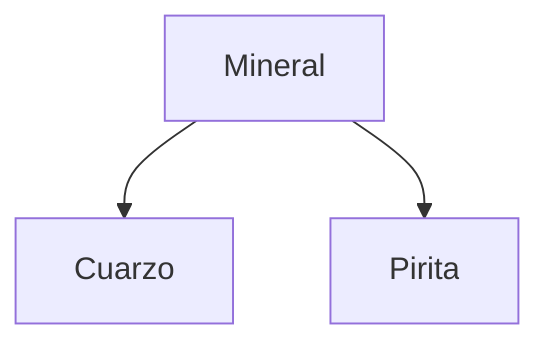

# Conceptos de POO

#### Ejercicio 1

¿Cuáles serían los atributos de la clase PilotoDeFormula1? ¿Se te ocurren algunas instancias de esta clase?

- Atributos de la clase PilotoDeFormula1: 

  - String nombre;
  - String nacionalidad;
  - boolean licencia;
  - int edad;
  - int añosExperiencia;

- Instancias de la clase PilotoDeFormula1: 

  ``` java
  PilotoDeFormula1 juanito = new PilotoDeFormula1();
  ```

  - juanito 
  - miPilotoFavorito
  - pilotoGanador 
  - instructorDelPiloto 

####

#### Ejercicio 2

A continuación tienes una lista en la que están mezcladas  varias clases con instancias de esas clases. Para ponerlo un poco más  difícil, todos los elementos están escritos en minúscula. Di cuáles son  las clases, cuáles las instancias, a qué clase pertenece cada una de  estas instancias y cuál es la jerarquía entre las clases: paula, goofy,  gardfiel, perro, mineral, caballo, tom, silvestre, pirita, rocinante,  milu, snoopy, gato, pluto, animal, javier, bucefalo, pegaso,  ayudante_de_santa_claus, cuarzo, laika, persona, pato_lucas.

*Jerarquía de clases e instancias.*







####

#### Ejercicio 3

¿Cuáles serían los atributos de la clase Vivienda? ¿Qué subclases se te ocurren?

- Atributos de Vivienda: 

  - int medidaCasa;
  - String direccion;
  -  int numeroHabitacion;
  - int precio;

- Subclases de Vivienda: 

  ```java
  public class Piso extends Vivienda {
  }
  ```

  - Piso  
  - Casa 
  - Mansion 

#### 

#### Ejercicio 4

Piensa en la liga de baloncesto, ¿qué 5 clases se te ocurren para representar 5 elementos distintos que intervengan en la liga?

- Jugador
- Equipo
- Entrenador
- Partido
- Contrincante

#### 

#### Ejercicio 5

Haz una lista con los atributos que podría tener la clase  caballo. A continuación haz una lista con los posibles métodos (acciones asociadas a los caballos).

Clase Caballo:

- Atributos: 

  - String nombre;
  - String raza;
  - String color;
  - int edad;
  - String sexo;

- Métodos: 

  ```java
  void trota() {
  }
  ```

  - trota
  - relincha
  - come
  - salta
  - corre

#### 

#### Ejercicio 6

Lista los atributos de la clase Alumno ¿Sería nombre uno de los atributos de la clase? Razona tu respuesta.

Clase Alumno:

- nombre
- fechaNacimiento
- curso
- direccion
- telefono

"nombre" es un atributo y una de las propiedades de la clase Alumno, en la que guarda un conjunto de características (el nombre completo con tilde, espacio, minuscula, mayuscula, etc) que comparten los objetos de la clase Alumno.

#### 

#### Ejercicio 7

¿Cuáles serían los atributos de la clase Ventana (de  ordenador)? ¿cuáles serían los métodos? Piensa en las propiedades y en el comportamiento de una ventana de cualquier programa.

- Atributos de la clase Ventana:
  - titulo
  - posicion 
  - anchura
  - altura
  - colorDeFondo 
  - esVisible
- Métodos de la clase Ventana: 
  - abre
  - maximiza
  - minimiza
  - restaura
  - cierra
  - mueve